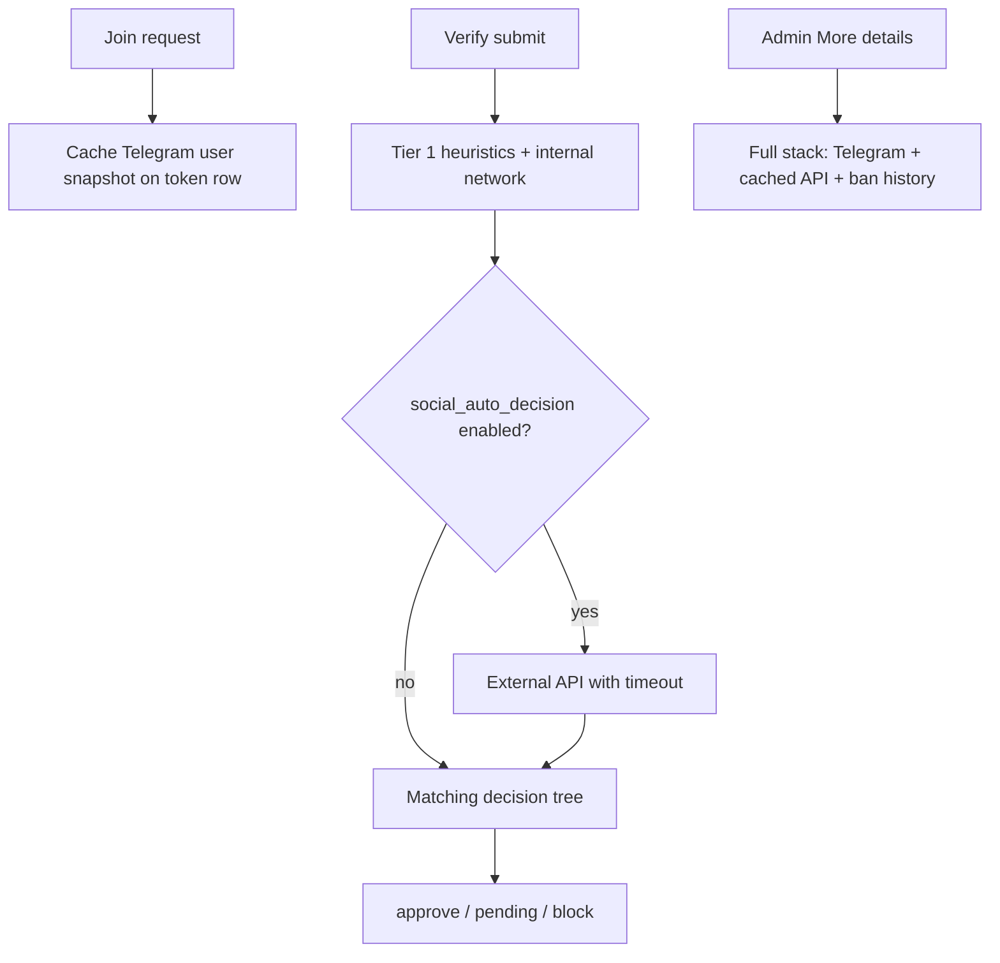

# Join verification — brainstorm

**Last updated:** 2026-06-25  
**Status:** Member journey shipped (feature pack 12/12). **Social profiling** is the next design pass.

---

## Simple member journey (shipped)

1. User clicks join on the Telegram channel.
2. Bot sends a DM with a link to the verification webpage.
3. User completes a minimal verification page (feels routine, not “security heavy”).
4. **Approved** → bot grants access automatically + confirmation DM with channel link.
5. **Denied** → user sees only **“Account restricted”** on the site; no detailed reason.

## Admin & network (shipped)

- All verification outcomes are reported to the **admin Telegram channel**.
- Hard deny (local ban evasion, configured instant-ban categories) → **auto-ban** from the channel.
- Pending / cross-channel history → **review**, not auto-ban from network history alone.
- Ban records must include **date + reason + category**; reviewing admins see full history from other groups.
- **Blockchain profile** is the long-term identity record; enriched on each join and on evasion attempts.

## Link policy (shipped)

- ~10 minute token TTL.
- One active link per user; new join request invalidates the previous link.

---

# Social profiling design

## Problem statement

Admins need richer context on **who is joining** — especially for impersonation, bot farms, and scam accounts — without exposing that machinery to joiners. The PRD calls for **Telegram-native signals + external API enrichment**, wired into verify decisions and the admin **More details** button.

**Today:** plumbing exists; **no real data is collected.**

| Component | Status |
|-----------|--------|
| `SocialProfileProvider` protocol + `SocialProfileResult` | Done |
| `MockSocialProfileProvider` (env-driven test IDs) | Done |
| `NoOpSocialProfileProvider` (production default) | Active |
| `check_known_bad` calls `analyze()` at verify submit | Done — **user id only** |
| `details_*` callback calls `analyze()` for admin card | Done — **user id only** |
| `instant_ban_categories` policy field | Done in DB/defaults; **no wizard UI** |
| External vendor integration | **Not started** |
| Telegram-native heuristics provider | **Not started** |
| Per-session cache | **Not started** |

---

## Design principles

1. **Invisible to joiners** — no extra form fields, no “connect your socials,” no API error leakage.
2. **Admin-only enrichment** — raw signals and vendor payloads stay in ops channel / More details.
3. **Fail safe, not fail loud** — API timeout or outage must not break verify; behavior is **channel-configurable**.
4. **Minimal PII egress** — prefer Telegram user id + username; never send fingerprint, IP, or keystroke data to third parties.
5. **Reuse ban taxonomy** — hard/soft outputs map to existing `BanCategory` values (`bot_abuse`, `impersonation`, etc.).
6. **Layered providers** — compose cheap local signals first; call paid APIs only when policy says so.

---

## What we can collect (signal inventory)

### Tier 0 — Already in Singulr (no new collection)

| Signal | Source | Use |
|--------|--------|-----|
| Device fingerprint hash | Verify page (silent) | Local evasion, network registry |
| Keystroke / env flags | Verify page | Evasion, anomaly flag |
| Local ban history | DB | Instant ban (same channel) |
| Cross-channel ban history | DB + on-chain | Pending review |
| Stylometry (Watcher) | Channel messages post-join | Post-join only today |

### Tier 1 — Telegram Bot API (free, low latency)

Available at **join** (`ChatJoinRequest.from_user`) and **More details** (`get_chat_member`):

| Signal | Field | Notes |
|--------|-------|-------|
| User id | `user.id` | Stable; primary key everywhere |
| Username | `user.username` | Nullable; impersonation heuristics |
| Display name | `first_name` + `last_name` | Nullable last; string similarity vs channel brand |
| Language | `user.language_code` | Weak signal only |
| Is bot flag | `user.is_bot` | Always false for joiners; bots don’t join via join request |
| Premium | `user.is_premium` | Weak negative signal (paid account) |
| Profile photo | `get_user_profile_photos` | Extra API call; “default avatar” heuristic |

**Not available** via standard Bot API without user interaction:

- Account creation date
- Mutual groups/channels (unless bot is in those chats and you scan — expensive, fragile)
- Phone number, email, linked socials

**Recommendation:** build `TelegramNativeProvider` that runs **heuristics only** (no external HTTP) using fields we already have at join + verify.

Example heuristics (all soft unless channel policy elevates):

- `no_username` — account has no @handle
- `display_name_channel_brand_overlap` — name contains channel title or known admin names (impersonation soft)
- `username_suspicious_pattern` — digits-only suffix, “support”, “official”, homoglyphs (needs curated rules)
- `default_avatar` — no profile photos (if we pay for the extra call)

### Tier 2 — Singulr network (internal “social graph”)

| Signal | Source | Use |
|--------|--------|-----|
| Prior verify outcomes | Profiles + bans | Already in matching |
| Fingerprint-linked accounts | Profile table | Same person, new Telegram id |
| Channel trust / reputation | `TRUSTED_CHANNEL_IDS`, on-chain score | Already in network pack |

This is **not** third-party social profiling but should be merged into the same `SocialProfileResult` so admins see one summary line.

### Tier 3 — External APIs (vendor TBD)

Purpose: high-confidence **bot / scam / impersonation** classification beyond heuristics.

**Candidate input identifiers** (pick per vendor ToS):

- Telegram user id (some vendors support)
- @username
- Display name string

**Never send:** fingerprint hash, IP hash, keystroke vectors, raw message content.

**Candidate output mapping:**

| Vendor-style label | Maps to `hard_categories` | Maps to `soft_signals` |
|--------------------|---------------------------|--------------------------|
| Confirmed bot / automation | `bot_abuse` | — |
| Impersonation / fake support | `impersonation` | — |
| Scam / fraud account | `scam_fraud` | — |
| Spam / solicitation risk | — | `vendor_spam_risk` |
| Low confidence / review | — | bump `risk_score` only |

**Vendor selection criteria** (brainstorm homework):

- Telegram-specific or generic social OSINT?
- Latency p95 under 1.5s?
- Pricing per lookup vs monthly cap?
- Data retention / GDPR DPA?
- False positive rate on crypto/community channels?

**Shortlist to evaluate** (no commitment — research spike):

1. **Telegram-only heuristics first** — $0, ship Phase 1 without vendor lock-in
2. **Community-maintained blocklists** — optional feed of known scam user ids (self-hosted JSON)
3. **Commercial API** — evaluate 1–2 vendors in a spike; abstract behind `ExternalApiProvider`

---

## When to run analysis

### Decision: hybrid timing (recommended)



| Phase | Trigger | Providers | Affects auto-decision? |
|-------|---------|-----------|------------------------|
| **A** | Verify submit | Tier 1 + Tier 2 | Yes — hard → BLOCK if in `instant_ban_categories`; soft → PENDING |
| **B** | Verify submit (if enabled) | Tier 3 external | Yes — same mapping; **timeout 1.5s** |
| **C** | More details only | Re-run or read cache | No — display only (fallback if A/B skipped API) |

**Why not external-only on More details?**  
Admins want auto-ban for obvious bots **before** manual review. But channels that distrust vendors can disable Tier 3 and rely on heuristics + local/network checks only.

**Why not external on every join request?**  
Wastes API credits on users who never open the verify link. Run at **submit** when intent is proven.

### Fail behavior (channel policy — new field)

| Mode | API timeout / error | Rationale |
|------|---------------------|-----------|
| `fail_open` (default) | Treat as empty social result; continue matching | Maximize join conversion |
| `fail_closed` | Force PENDING | Paranoid channels |
| `fail_closed_strict` | Force PENDING only when other risk factors exist | Balanced |

Add `social_api_fail_mode: fail_open | fail_closed` to `ChannelSecuritySettings` in a future pack.

---

## Provider architecture (target)

### Composite provider (replace single factory)

```
get_social_profile_provider()
  └── CompositeSocialProfileProvider
        ├── TelegramNativeProvider      (always on when social enabled)
        ├── InternalNetworkProvider     (optional merge of DB hints)
        └── ExternalApiProvider         (gated by env + channel policy)
```

**Merge rules:**

- `hard_categories` = union of all providers; dedupe
- `soft_signals` = union
- `risk_score` = max across providers
- `summary` = admin-readable concatenation (redacted, no vendor raw JSON in Telegram message)

### Context object (extend protocol)

Today `analyze()` accepts optional username/display_name but **callers don’t pass them**. Fix:

```python
@dataclass(frozen=True)
class SocialProfileContext:
    telegram_user_id: int
    channel_id: int
    username: str | None = None
    display_name: str | None = None
    channel_title: str | None = None   # impersonation checks
    verify_token: str | None = None    # cache key
```

**Where to populate context:**

1. **Join request** — persist snapshot on `VerificationToken` or new `JoinUserSnapshot` JSON column (`username`, `display_name`, `language_code` at join time). Usernames can change before submit; join-time snapshot is still useful for audit.
2. **Verify submit** — load snapshot from token row; pass to `analyze()`.
3. **More details** — refresh live Telegram fields via bot; pass fresh context.

### Caching

| Key | TTL | Storage |
|-----|-----|---------|
| `(telegram_user_id, channel_id, verify_token)` | 10 min (token TTL) | In-memory or Redis; v1 can use DB column on token |
| External API response | Same | Avoid double-billing on More details + submit |

Log cache hits at debug level; never log vendor API keys or full response bodies.

---

## Decision mapping (unchanged from feature pack)

Already implemented in `matching.check_known_bad`:

```
hard category ∈ channel.instant_ban_categories  →  BLOCK
soft signals OR risk_score >= 40                  →  PENDING
else                                            →  no social contribution
```

**Thresholds to make configurable later:**

- `social_pending_score_threshold` (default 40)
- `social_hard_min_confidence` if vendor returns confidence 0–1

**Categories in scope for instant ban** (defaults today):

- `impersonation`
- `bot_abuse`

Admins may add `scam_fraud` on strict channels via policy — **needs wizard step**.

---

## Admin UX

### More details card (extend)

Current: user id, channel id, username, display name, social summary string, ban history.

**Add:**

- List of `soft_signals` as bullet lines
- `hard_categories` if any (even post-decision)
- Provider attribution: `Sources: telegram_native, mock` (admin-only)
- Timestamp of analysis

### Ops channel compact card

On PENDING/BLOCK from social:

- One line: `Social: elevated (bot_abuse suspected)` — not vendor jargon
- Full detail behind More details

---

## Privacy & compliance

| Data | Joiner sees | Admin sees | Third party | On-chain |
|------|-------------|------------|-------------|----------|
| Telegram id / username | — | yes | optional | no |
| Fingerprint hash | — | truncated | **never** | hash only |
| Vendor risk label | — | yes | — | category only on ban |
| API raw JSON | — | no (redacted) | — | no |

- Document in ops runbook: what each provider stores and retention period.
- Allow `SOCIAL_PROFILE_PROVIDER=none` for air-gapped deployments (current default).

---

## Implementation phases

### Phase 1 + 2 — shipped (2026-06-25)

- `SocialProfileContext` + join-time snapshot on `VerificationToken` (username, display name, language, channel title)
- `TelegramNativeProvider` heuristics: no username, suspicious username patterns, empty display name, brand overlap
- `CompositeSocialProfileProvider` (telegram native + optional mock via env)
- Token-row cache (`social_profile_cache`, `social_analyzed_at`); More details reads cache first
- Channel policy: `social_profiling_enabled`, `social_api_fail_mode`, `social_pending_score_threshold`
- `analyze_social_profile()` with cache hit logging, duration metrics, fail_closed → PENDING
- Pending decision uses **risk score ≥ threshold** (default 40); weak signals alone do not hold joiners

### Phase 3 — external API (not started)

- [ ] `ExternalApiProvider` with httpx, 1.5s timeout, redacted logging
- [ ] Env: `SOCIAL_API_URL`, `SOCIAL_API_KEY`, `SOCIAL_API_ENABLED`
- [ ] One vendor POC; map response → `hard_categories` / `soft_signals`
- [ ] Integration test with recorded fixture (no live API in CI)

### Phase 4 — Admin configurability

- [ ] `/security` wizard step: instant-ban category multi-select (reuse network categories UI pattern)
- [ ] Toggle: “Use external social API at verify” per channel
- [ ] `format_policy_summary` shows social settings

---

## Open questions (need your call)

| # | Question | Recommendation |
|---|----------|----------------|
| 1 | Should Tier 1 heuristics alone ever **BLOCK**, or only PENDING? | **PENDING only** unless hard rule like `user.is_bot` (N/A for joiners). Reserve BLOCK for local evasion + vendor hard categories. |
| 2 | External API at submit for all channels or opt-in? | **Opt-in** per channel; default off until vendor chosen. |
| 3 | Store join-time vs submit-time username? | **Both** — snapshot at join, refresh at submit if bot can resolve user. |
| 4 | Profile photo check worth the API call? | **Defer** — add in Phase 1b if impersonation false negatives are high. |
| 5 | Self-hosted scam id list vs commercial API first? | **Self-hosted list** is cheap win alongside Tier 1; commercial API in Phase 3. |
| 6 | Should social BLOCK use `persist_ban` with structured category? | **Yes** — same as other auto-bans; reason text admin-only. |

---

## Success metrics

- % verify submits with non-empty social result (Tier 1+)
- PENDING rate attributable to social (vs network/evasion)
- Admin Permit rate on social-pending cases (calibrate thresholds)
- External API p95 latency & error rate
- False positive reports from channel admins (qualitative)

---

## Next steps

1. **Approve** hybrid timing + phased provider stack above.
2. **Answer** open questions 1–2 (BLOCK from heuristics? external opt-in?).
3. Run `/tasks` on a short **social-profiling-v1** PRD slice → autopilot pack for Phase 1 only.
4. Optional: 2-hour vendor research spike (doc findings in `docs/plans/social-api-vendor-notes.md`).

---

## Related docs

- [feature.md](../autopilot/feature/feature.md) — F6, F8 external API requirements
- [feature-notes.md](../autopilot/feature/feature-notes.md) — shipped baseline
- Code: `singulr/services/social_profile.py`, `matching.py`, `handlers.py` (`details_*`)
